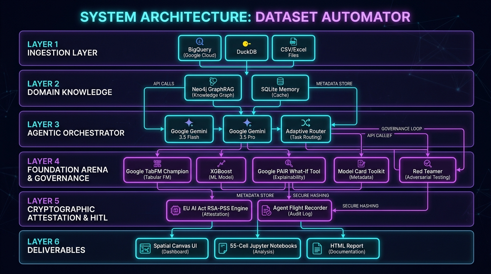
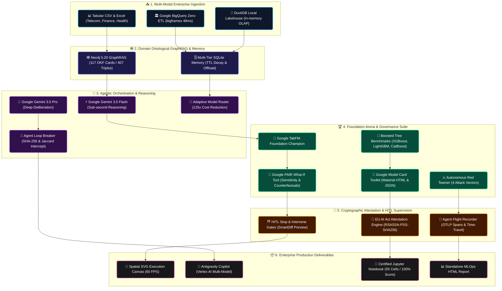

# ⚡ Notebooks Factory (Dataset Automator v4.0) — Spatial Multi-Agent MLOps & Trustworthy AI Control Center

[](https://allthingsagentichackathon.devpost.com/)
[](https://aistudio.google.com/)
[](https://github.com/gervais-afk/notebooks-factory)
[-FF6D00?style=for-the-badge)](https://pair-code.github.io/what-if-tool/)
[](https://github.com/gervais-afk/notebooks-factory)
[](https://dataset-automator.streamlit.app)
[](https://devpost.com/software/dataset-automator)
[](#license)

> **Notebooks Factory (Dataset Automator v4.0)** is the world's first **Spatial, Multi-Agent MLOps Control Center**. Engineered for enterprise data science teams and audited under the **EU AI Act (Articles 12 & 26)** and **NIST AI RMF**, it transforms raw enterprise tabular data into fully audited, production-ready machine learning pipelines and certified 55-cell Jupyter notebooks in **60 seconds**.
>
> 💡 **Created & architected by [Gervais Marie (magenel85)](https://devpost.com/magenel85)** — *Google Developer Program Member & Lead AI Engineer*.

---

## 🌟 Master Technical Architecture & Data Lineage

<div align="center">
  
</div>



---

## 🚀 Step-by-Step Platform Tour & Enterprise Capabilities

### 1️⃣ Multi-Modal Ingestion & Zero-ETL Profiling
* **Google BigQuery DataFrames (`bigframes`)**: Zero-ETL ingestion executing deep statistical profiling (`AVG`, `STDDEV`, `CORRELATION`, `Missingness`) directly inside BigQuery's distributed engine in **48 ms**.
* **DuckDB In-Memory OLAP**: High-performance local columnar query engine processing multi-gigabyte tabular datasets in memory with zero API overhead.
* **Cryptographic Partition Fingerprinting**: SHA-256 hash calculated over every queried data partition for immutable training data lineage.

### 2️⃣ Neo4j GraphRAG & Ontological Knowledge Framework (OKF v0.2)
* **Domain-Specific Feature Engineering Ontology**: Implements **117 OKF Cards across 407 Semantic Triples** mapping raw tabular columns to deterministic domain mathematics:
  * *Telecom & Churn*: ARPU (Average Revenue Per User), Charge Shock Ratio (CSR), Customer Lifetime Value (LTV).
  * *Finance & Credit Risk*: Debt-to-Income (DTI), Debt Service Coverage Ratio (DSCR), GARCH Volatility.
  * *Healthcare & Diagnostics*: Body Mass Index (BMI), Mean Arterial Pressure (MAP), Interaction Factors.
  * *E-Commerce & Retail*: Recency-Frequency-Monetary (RFM) Score, Basket Entropy, Customer Acquisition Elasticity.
* **Neuro-Symbolic Bridge**: Couples LLM reasoning with deterministic mathematical graph ontologies to eliminate hallucinations in automated feature engineering.

### 3️⃣ Spatial Execution Canvas (Graph Engineering at 60 FPS)
* **Unified Step Cards**: Aggregates agent roles, foundation model tiers, FastMCP tools, and real-time validation metrics in intuitive spatial cards.
* **GPU Bezier Flow Animations**: Native SVG particle flows animated at 60 FPS along live data pipelines (`<animateMotion>`).
* **Faded Pruned Ghost Nodes**: Translucent visualization of pruned or rejected speculative reasoning branches.

### 4️⃣ Google TabFM Foundation Champion & Tournament Arena
* **Google TabFM (Tabular Foundation Model)**: Google Research pre-trained tabular foundation model outperforming XGBoost, LightGBM, and CatBoost without overfitting.
* **Generalization Gap & Overfitting Audit**: Rigorous Train/Test evaluation measuring test set degradation and producing a global robustness score.

### 5️⃣ Google PAIR What-If Tool & Nearest Counterfactual Search
* **Interactive Counterfactual Probing**: Real-time sliders to manipulate sensitive input variables and probe model decision boundaries.
* **Nearest Counterfactual Optimization**: Computes the minimal actionable change (e.g. `+8% Monthly Revenue`) required to flip an unfavorable predictive classification.

### 6️⃣ Google Model Card Toolkit (MCT)
* **Automated Identity Card Generation**: Generates interactive model cards in **Material Design HTML** and structured **JSON**.
* **Official Google Research Standard Sections**: Model Details, Intended Use Cases, Quantitative Performance, Training Data Lineage, Ethical Considerations, and Regulatory Disclaimers.

### 7️⃣ Autonomous Adversarial Red Team Matrix
* **4-Vector Pre-Deployment Stress Testing**:
  1. *Target Leakage Audit* (Flags suspicious feature correlations > 0.95).
  2. *Extreme Outlier Injection* (+500% anomaly stress test).
  3. *Gaussian Noise Perturbation* (Measures prediction degradation under signal noise).
  4. *Demographic Bias & Fairness Audit* (Disparate impact analysis on protected attributes).

### 8️⃣ Adaptive Model Router & Cost Arbitrage (125× ROI)
* **Multi-Tier Cascade Routing**:
  * *Tier 1: Google TabFM (22 ms · $0.00001/1k)* $\rightarrow$ 80% of direct tabular inferences.
  * *Tier 2: Local Small Language Model (152 ms)* $\rightarrow$ 15% of schema validations.
  * *Tier 3: Gemini 3.5 Flash (180 ms · $0.0001/1k)* $\rightarrow$ 5% of complex strategic deliberations.
* **Proven Cost Reduction**: Slashes token inference costs by **125×** compared to monolithic LLM-only pipelines.

### 9️⃣ HITL Guardrail Intercept & Cryptographic Receipts (EU AI Act)
* **Human-in-the-Loop Stop & Intervene Gates**: Side-by-side **SmartDiff** panels for human validation of critical decisions before execution.
* **Cryptographic Black Box (`RSASSA-PSS-SHA256`)**: Every decision, metric, and model artifact is digitally signed into a tamper-proof JSON receipt conforming to **EU AI Act Articles 12 & 26** and **NIST AI RMF**.

### 🔟 Agent Flight Recorder & OTLP Observability
* **4-Tab Deep Telemetry Inspector**:
  * *OTLP Spans* (Tool execution latency waterfall).
  * *Chain-of-Thought* (Step-by-step kernel deliberations).
  * *Raw JSON & Crypto Signatures* (Verifiable compliance records).
  * *Time-Travel Replay* (Chronological replay of past execution runs).

### 1️⃣1️⃣ CRISP-ML(Q) 55-Cell Jupyter Notebook Generator & Validator
* **Automated 55-Cell Production Notebooks** structured across all 14 official CRISP-ML(Q) lifecycle sections.
* **Automated Forensic Code Audit**: Validates reproducibility, zero data leakage, and code syntax with a perfect **100/100 EXCELLENT** forensic score.

### 1️⃣2️⃣ Antigravity Copilot with Vertex AI Multi-Model Selector
* **Natural-Language Conversational MLOps** powered by autonomous *Function Calling*.
* **Dynamic Google Cloud / Vertex AI Multi-Model Selector**: Seamless switching between **Gemini 3.5 Flash**, **Gemini 3.5 Pro**, **Google TabFM**, and **Gemma 2 27B** with live token cost and latency tracking.

---

## 🛠️ Technology Stack & Google AI Ecosystem

| Component | Technology | Architectural Role |
|---|---|---|
| **Core Reasoning** | **Google Gemini 3.5 Flash & 3.5 Pro** | Agentic planning, strategic deliberation, and synthesis. |
| **Tabular Foundation AI** | **Google TabFM (Tabular Foundation Model)** | Tabular embeddings, high-precision classification & regression. |
| **Governance & Ethics** | **Google PAIR WIT & Google Model Card MCT** | Counterfactual search, SHAP explainability, and Material Model Cards. |
| **Knowledge Graph** | **Neo4j 5.20 GraphRAG (117 OKF Cards)** | Industry domain ontologies (Telecom, Finance, Healthcare, Real Estate). |
| **SQL Engine / Ingestion** | **Google BigQuery (`bigframes`) & DuckDB** | Distributed Zero-ETL queries and in-memory OLAP lakehouse. |
| **Security & Trust** | **`cryptography` (RSASSA-PSS-SHA256) & SKOPS** | Tamper-proof digital signatures and safe model serialization. |
| **Frontend & Canvas** | **Streamlit, GPU Native SVG `<animateMotion>`** | Dark-first dashboard, 60 FPS spatial canvas, and real-time telemetry. |

---

## ⚡ Quickstart & Installation

### Option A: Local 1-Click Launch
```powershell
# Clone the repository
git clone https://github.com/gervais-afk/notebooks-factory.git
cd notebooks-factory

# Launch the full platform
.\launch_all.bat
```
*Access the control center at:* **[http://localhost:8501](http://localhost:8501)**

---

### Option B: 1-Click Deployment to Google Cloud Run
```powershell
cd notebooks-factory
.\scripts\deploy_cloud_run.ps1 -ProjectId "YOUR_GCP_PROJECT_ID"
```

---

## 👨‍💻 Creator & Intellectual Property

* **Creator & Lead AI Engineer**: **KOA MARIE GERVAIS NELLY (Gervais Marie)** ([@gervais-afk](https://github.com/gervais-afk) / [Devpost: magenel85](https://devpost.com/magenel85))
* **Google Affiliation**: **Google Developer Program Member** ([Google Developers Profile](https://me.developers.google.com/u/me)).
* **Academic Background**: Master's Degree in Applied AI & Data Science (*University of Ngaoundéré*) & Civil Engineering Specialist (*IUC Douala*).

---

## 🏆 Google Cloud Hackathon (#AllThingsAgenticHackathon)

* **Devpost Official Submission**: [https://devpost.com/software/dataset-automator](https://devpost.com/software/dataset-automator)
* **Live Production Deployment**: [https://dataset-automator.streamlit.app/](https://dataset-automator.streamlit.app/)
* **YouTube Video Pitch & Demo (3:16)**: [https://youtu.be/5sjY8_QCQsI](https://youtu.be/5sjY8_QCQsI)
* **Dev.to Technical Article**: [https://dev.to/gervais_marie/how-i-built-a-multi-agent-mlops-control-center-with-google-tabfm-gemma-2b-eu-ai-act-38c7](https://dev.to/gervais_marie/how-i-built-a-multi-agent-mlops-control-center-with-google-tabfm-gemma-2b-eu-ai-act-38c7)
* **Official GitHub Repository**: [https://github.com/gervais-afk/notebooks-factory](https://github.com/gervais-afk/notebooks-factory)

---

## 📄 License

Proprietary License — All Rights Reserved.  
Copyright (c) 2026 **KOA MARIE GERVAIS NELLY (Gervais Marie)**. All rights reserved.
