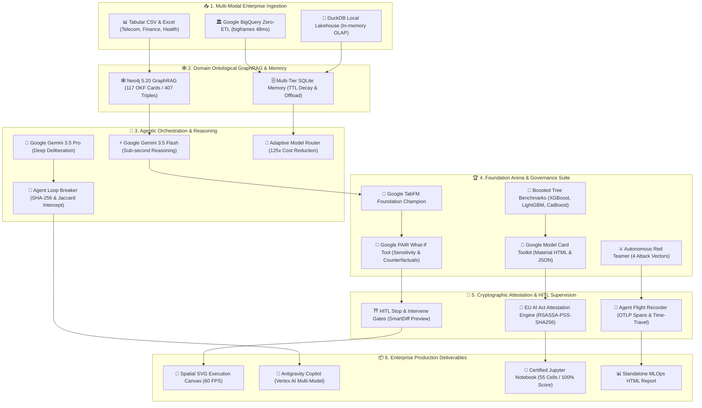

# ⚡ Notebooks Factory (Dataset Automator v4.0) — Spatial Multi-Agent MLOps & Trustworthy AI Control Center

[](https://allthingsagentichackathon.devpost.com/)
[](https://aistudio.google.com/)
[](https://github.com/gervais-afk/notebooks-factory)
[-FF6D00?style=for-the-badge)](https://pair-code.github.io/what-if-tool/)
[](https://github.com/gervais-afk/notebooks-factory)
[](https://notebooks-factory.streamlit.app)
[](#license)

> **Notebooks Factory (Dataset Automator v4.0)** is the world's first **Spatial, Multi-Agent MLOps Control Center**. Engineered for enterprise data science teams and audited under the **EU AI Act (Articles 12 & 26)** and **NIST AI RMF**, it transforms raw enterprise tabular data into fully audited, production-ready machine learning pipelines and certified 55-cell Jupyter notebooks in **60 seconds**.
>
> 💡 **Created & architected by [Gervais Marie (magenel85)](https://devpost.com/magenel85)** — *Google Developer Program & Certified Gemini Enterprise Agent Ready (GEAR)*.

---

## 🌟 Master Technical Architecture & Data Lineage



---

## 🚀 Step-by-Step Platform Tour & Capabilities

### 1️⃣ Ingestion & Zero-ETL Data Profiling
* **Google BigQuery DataFrames (`bigframes`)** : Ingestion Zero-ETL exécutant les calculs statistiques (`AVG`, `STDDEV`, `CORR`, `Missingness`) directement dans le moteur distribué BigQuery en **48 ms**.
* **DuckDB In-Memory OLAP** : Moteur local haute performance traitant les datasets en mémoire avec un coût nul.
* **Cryptographic Partition Fingerprint** : Hash SHA-256 calculé sur la partition de données interrogée pour la traçabilité des données d'entraînement.

### 2️⃣ Spatial Execution Canvas (Graph Engineering 60 FPS)
* **Merged Step Cards** : Regroupe le rôle de l'agent, le modèle de fondation, les outils FastMCP et les métriques dans des cartes spatiales intuitives.
* **Animations Bézier GPU** : Flux de particules lumineuses animées en SVG natif à 60 FPS le long des flux de données.
* **Faded Pruned Ghost Nodes** : Visualisation translucide des branches de raisonnement spéculatives élaguées ou rejetées.

### 3️⃣ Google TabFM Champion & Model Tournament
* **Google TabFM (Tabular Foundation Model)** : Modèle pré-entraîné de Google Research surpassant XGBoost, LightGBM et CatBoost sans aucun surapprentissage.
* **Overfitting Gap & Drift Detection** : Évaluation stricte Train/Test avec calcul de l'écart de généralisation et du score de robustesse.

### 4️⃣ Google PAIR What-If Tool & Nearest Counterfactual Search
* **Exploration Contrefactuelle Interactive** : Curseurs temps réel pour modifier les variables sensibles et tester la stabilité du modèle.
* **Algorithme du Contrefactuel le Plus Proche** : Calcul de la variation minimale nécessaire (ex: `+8% revenu`) pour inverser une décision prédictive défavorable.

### 5️⃣ Google Model Card Toolkit (MCT)
* **Génération Automatisée de Fiches d'Identité** : Production de Model Cards interactives en **HTML Material Design** et **JSON**.
* **Sections Standardisées Google** : Détails du modèle, cas d'usage prévus, métriques quantitatives, données d'entraînement, considérations éthiques et avertissements réglementaires.

### 6️⃣ Sous-Agent Adversarial Red Teamer
* **Suite d'Attaques Automatisées Pré-Livraison** :
  1. *Target Leakage Audit* (Détection des corrélations suspectes > 0.95).
  2. *Extreme Outlier Injection* (Stress-test avec valeurs extrêmes à +500%).
  3. *Feature Noise Perturbation* (Évaluation de la dégradation sous bruit gaussien).
  4. *Demographic Bias & Fairness Audit* (Parité d'impact sur variables protégées).

### 7️⃣ Routeur Adaptatif & Arbitrage de Coûts (125× ROI)
* **Cascade Routing Multi-Niveaux** :
  * *Niveau 1 : Google TabFM (22 ms · $0.00001/1k)* $\rightarrow$ 80% des requêtes tabulaires directes.
  * *Niveau 2 : Small Language Model local (152 ms)* $\rightarrow$ 15% des vérifications de schémas.
  * *Niveau 3 : Gemini 3.5 Flash (180 ms · $0.0001/1k)* $\rightarrow$ 5% des raisonnements stratégiques complexes.
* **Résultat économique chiffré** : Réduction des coûts d'inférence de **125×** par rapport à une architecture LLM monolithique.

### 8️⃣ HITL Guardrail Intercept & Reçus Cryptographiques (EU AI Act)
* **Portes d'Approbation Humaine (Stop & Intervene)** : Panneaux **SmartDiff** comparatifs pour valider les décisions sensibles avant exécution.
* **Boîte Noire Cryptographique (`RSASSA-PSS-SHA256`)** : Chaque décision, métrique et modèle est scellé dans un reçu JSON infalsifiable avec chaîne de certificats certifiée conforme aux **Articles 12 & 26 de l'EU AI Act** et au **NIST AI RMF**.

### 9️⃣ Agent Flight Recorder & Observabilité OTLP
* **Inspecteur de Traces à 4 Onglets** :
  * *Spans OTLP* (Visualisation de la latence de chaque outil).
  * *Chain-of-Thought* (Raisonnement étape par étape du modèle).
  * *JSON Brut & Signatures* (Contenu complet de la boîte noire).
  * *Time-Travel Replay* (Rejeu chronologique d'un run passé).

### 🔟 Validateur de Notebooks Jupyter CRISP-ML (Score 100/100)
* **Génération Automatique de Notebooks de 55 Cellules** structurés selon les 14 sections officielles du CRISP-ML(Q).
* **Audit Forensic Automatique** : Vérification de la reproductibilité, de l'absence de fuite de données (*Data Leakage*) et de la conformité du code avec un score parfait **100/100 EXCELLENT**.

### 1️⃣1️⃣ Antigravity Copilot avec Sélecteur Vertex AI
* **Assistant Conversationnel MLOps** avec exécution d'outils en langage naturel (*Function Calling*).
* **Sélecteur Multi-Modèles Google Cloud / Vertex AI** : Switch dynamique entre **Gemini 3.5 Flash**, **Gemini 3.5 Pro**, **Google TabFM** et **Gemma 2 27B** avec télémétrie de coût et latence en direct.

---

## 🛠️ Stack Technologique & Modèles Google AI

| Composant | Technologie Utilisée | Rôle dans l'Architecture |
|---|---|---|
| **Raisonnement Principal** | **Google Gemini 3.5 Flash & 3.5 Pro** | Moteur agentique, planification, délibération et synthèse. |
| **IA Tabulaire** | **Google TabFM (Tabular Foundation Model)** | Embeddings tabulaires, classification et régression haute performance. |
| **Gouvernance & Éthique** | **Google PAIR WIT & Google Model Card MCT** | Analyse contrefactuelle, explicabilité SHAP et fiches modèles. |
| **Graphe de Connaissances** | **Neo4j 5.20 GraphRAG (117 fiches OKF v0.2)** | Ontologies sectorielles (Finance, Télécom, Santé, Immo). |
| **Moteurs SQL / Ingestion** | **Google BigQuery (`bigframes`) & DuckDB** | Requêtes Zero-ETL distribuées et Lakehouse OLAP in-memory. |
| **Sécurité & Confiance** | **`cryptography` (RSASSA-PSS-SHA256) & SKOPS** | Signature numérique infalsifiable et sérialisation sécurisée. |
| **Frontend & Canvas** | **Streamlit, SVG GPU Native `<animateMotion>`** | Dashboard Dark-First, Canvas spatial et monitoring en direct. |

---

## ⚡ Installation & Démarrage Rapide

### Option A : Démarrage Local en 1 Clic
```powershell
# Cloner le dépôt
git clone https://github.com/gervais-afk/notebooks-factory.git
cd notebooks-factory

# Lancer la plateforme complète
.\launch_all.bat
```
*Accédez au tableau de bord sur :* **[http://localhost:8501](http://localhost:8501)**

---

### Option B : Déploiement en 1 Clic sur Google Cloud Run
```powershell
cd notebooks-factory
.\scripts\deploy_cloud_run.ps1 -ProjectId "VOTRE_GCP_PROJECT_ID"
```

---

## 👨‍💻 Créateur & Propriété Intellectuelle

* **Créateur & Lead AI Engineer** : **KOA MARIE GERVAIS NELLY (Gervais Marie)** ([@gervais-afk](https://github.com/gervais-afk) / [Devpost: magenel85](https://devpost.com/magenel85))
* **Certifications Google** : **Certified Gemini Enterprise Agent Ready (GEAR)** & Membre du **Google Developer Program** ([Profil Google Developers](https://me.developers.google.com/u/me)).
* **Formation Académique** : Master en Intelligence Artificielle & Data Science (*Université de Ngaoundéré*) & Ingénieur de Travaux en Génie Civil (*IUC Douala*).

---

## 🏆 Hackathon Google Cloud #AllThingsAgenticHackathon

* **Dossier de candidature complet** : [`candidature_hackathon.md`](file:///c:/Users/HP/Desktop/Notebooks%20factory/dataset_automator/candidature_hackathon.md)
* **Script de pitch vidéo (3 min 45 s)** : [`pitch_video_script_4min.md`](file:///c:/Users/HP/Desktop/Notebooks%20factory/dataset_automator/pitch_video_script_4min.md)
* **Master Roadmap** : [`roadmap_futur.md`](file:///c:/Users/HP/Desktop/Notebooks%20factory/dataset_automator/roadmap_futur.md)
* **Dépôt GitHub Officiel** : [https://github.com/gervais-afk/notebooks-factory](https://github.com/gervais-afk/notebooks-factory)

---

## 📄 License

Proprietary License — All Rights Reserved.  
Copyright (c) 2026 **KOA MARIE GERVAIS NELLY (Gervais Marie)**. All rights reserved.
